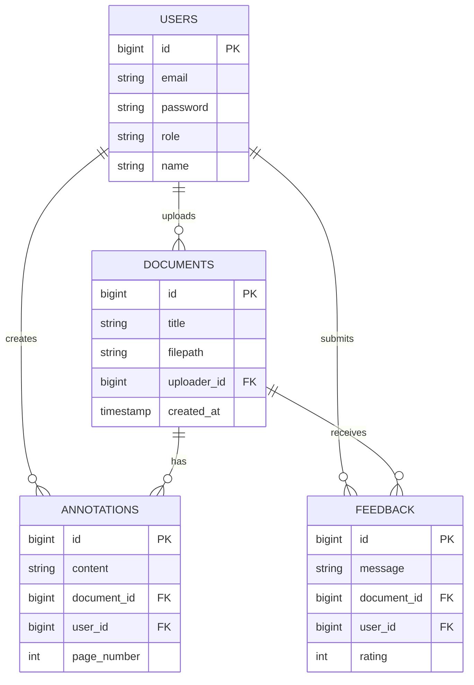
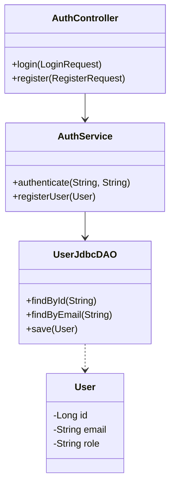
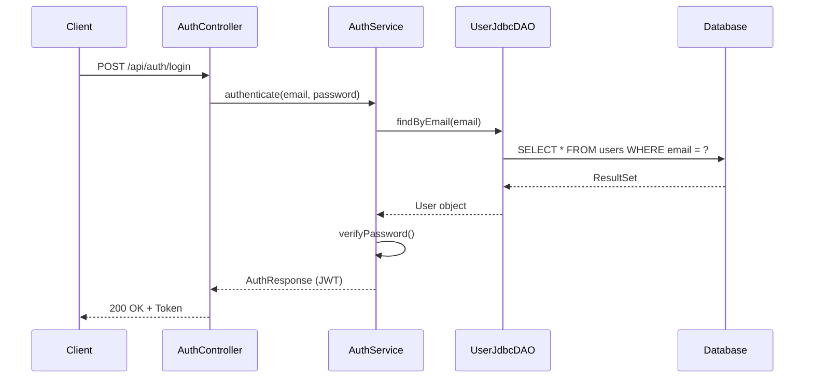
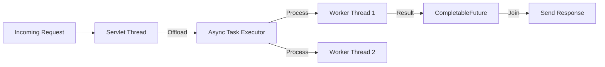

# 📐 System Design Document

## 1. System Architecture

The Paperless World application follows a standard MVC (Model-View-Controller) architecture integrated with Spring Boot's layered architecture.

```mermaid
graph TD
    Client[Client Layer\n(React / JSP)] -->|HTTP/REST| Controller[Controller Layer\n(Spring MVC / Servlets)]
    Controller -->|Calls| Service[Service Layer\n(Business Logic)]
    Service -->|Calls| DAO[DAO Layer\n(Data Access)]
    DAO -->|JDBC| DB[(MySQL Database)]
    
    subgraph Backend
    Controller
    Service
    DAO
    end
```

## 2. Database Schema (ER Diagram)

The database consists of four main entities with the following relationships:



## 3. Class Diagram (Core Components)

Key classes demonstrating the relationship between Controllers, Services, and DAOs.



## 4. Sequence Diagram: User Login

The flow of a login request through the system.



## 5. Threading Model

The application uses `CompletableFuture` for asynchronous operations to improve performance.


